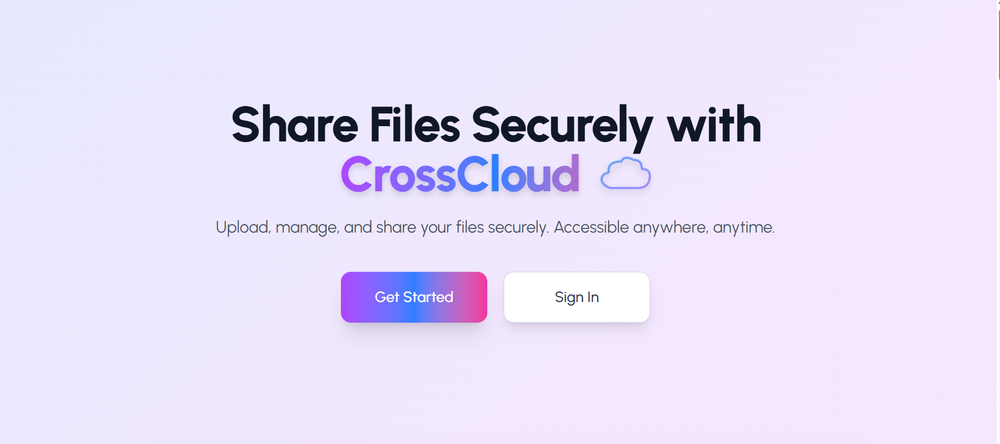
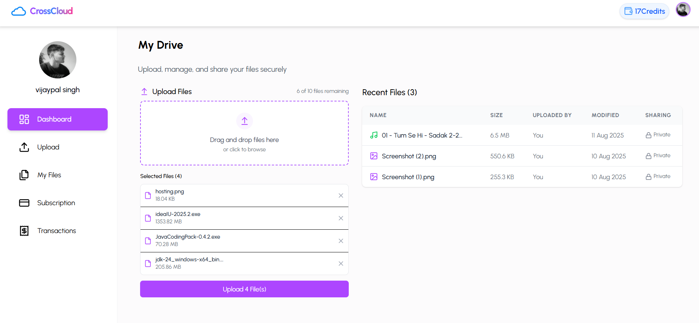

# CrossCloud – Secure File Sharing & Storage

## Overview

CrossCloud is a modern, secure file sharing and storage platform. Users can upload, manage, and share files, purchase credits, and view their transaction history. The app features a beautiful UI, robust authentication, and seamless payment integration.

---
Here is the images of UI
1. LANDING PAGE

---
3. DASHBOARD PAGE 

---
5. FEATURES PAGE 

---
7. PRICING PLANS 

---
### Mobile Screenshots (Responsive to all devices)

<p align="center">
  
  
</p>

---
## Tech Stack

- **Frontend:** React (Vite), Tailwind CSS, Axios
- **Backend:** Node.js, Express, Mongoose (MongoDB)
- **Authentication:** Clerk.dev
- **Payments:** Razorpay
- **Other:** JWT, REST API, Context API, Cloud deployment

---

## Features

- Secure file uploads and downloads
- User authentication (Clerk)
- Credits system for uploads
- Razorpay payment integration for purchasing credits
- Transaction history
- Responsive, modern UI
- Admin and user dashboards

---

## Project Structure

```
client/                 # Frontend React application
├── src/
│   ├── components/     # UI components
│   ├── context/        # React context providers
│   ├── layout/         # Layout components
│   ├── pages/          # Page components
│   └── util/           # Utility functions
server/                 # Backend Express API
├── config/             # Configuration files
├── controllers/        # API controllers
├── models/             # Mongoose models
├── routes/             # API routes
└── uploads/            # File storage (gitignored)
```

---

## Terminologies & Tools

- **Credits:** Each upload costs 1 credit. Buy more credits via Razorpay.
- **Clerk:** Used for user authentication and session management.
- **Razorpay:** Payment gateway for credit purchases.
- **MongoDB:** Stores user, file, and transaction data.
- **REST API:** Communication between frontend and backend.
- **Context API:** Manages user credits state in React.

---

## Packages Used

- `react`, `react-dom`, `react-router-dom`
- `@clerk/clerk-react`
- `axios`
- `tailwindcss`
- `lucide-react` (icons)
- `express`, `mongoose`, `dotenv`, `cors`
- `razorpay`, `crypto` (backend)
- `multer` (file uploads)

---

## Webhooks & Integrations

### Clerk Authentication

- Webhook endpoint: `/webhooks/clerk`
- User profile auto-creation on signup
- JWT token verification for API access

### Razorpay Payments

- Order creation endpoint: `/payments/create-order`
- Payment verification: `/payments/verify-payment`
- Credits are automatically added after successful payment

---

## Getting Started

### 1. Clone the Repository

```bash
git clone https://github.com/Vijaypal64328/CrossCloud-App.git
cd CrossCloud-App
```

### 2. Setup Environment Variables

- **Frontend (`client/.env`):**
  ```
  VITE_API_URL=http://localhost:5000
  VITE_CLERK_PUBLISHABLE_KEY=your_clerk_publishable_key
  VITE_RAZORPAY_KEY=your_razorpay_key
  ```

- **Backend (`server/.env`):**
  ```
  PORT=5000
  NODE_ENV=development
  MONGO_URI=your_mongodb_uri
  CLERK_WEBHOOK_SECRET=your_clerk_webhook_secret
  RAZORPAY_KEY_ID=your_razorpay_key_id
  RAZORPAY_KEY_SECRET=your_razorpay_key_secret
  MAX_FILE_SIZE=25000000
  UPLOAD_PATH=uploads/
  ```

> Example environment files are provided in `.env.example` files.

### 3. Install Dependencies

```bash
cd client
npm install
cd ../server
npm install
```

### 4. Run Locally

- **Backend:**  
  ```bash
  npm start
  ```
- **Frontend:**  
  ```bash
  npm run dev
  ```

### 5. Visit the App

- Local Frontend: [http://localhost:5173](http://localhost:5173)
- Local Backend: [http://localhost:5000](http://localhost:5000)
- Deployed Frontend: [https://crosscloud-app.onrender.com](https://crosscloud-app-frontend.onrender.com)
- Deployed Backend: [https://crosscloud-app-backend.onrender.com](https://crosscloud-app-backend.onrender.com)

---

## Deployment

### Render Deployment

The project includes a `render.yaml` file for easy deployment to Render:

1. **Backend (Web Service)**
   - Build Command: `cd server && npm install`
   - Start Command: `cd server && node server.js`
   - Environment Variables: Configure all variables from `.env.example`
   - URL: https://crosscloud-app-backend.onrender.com

2. **Frontend (Static Site)**
   - Build Command: `cd client && npm install && npm run build`
   - Publish Directory: `client/dist`
   - Environment Variables: Configure all VITE_* variables
   - Add the route rewrite: `/* /index.html 200`

### Setting Up Webhooks

1. **Clerk Webhooks**
   - Create a new webhook endpoint in Clerk dashboard
   - Point to: `https://crosscloud-app-backend.onrender.com/webhooks/clerk`
   - Select events: `user.created`, `user.updated`, etc.
   - Copy the signing secret to your server's `CLERK_WEBHOOK_SECRET` environment variable

2. **Razorpay Webhooks**
   - Configure in Razorpay dashboard
   - Add endpoints for payment events

For detailed deployment instructions, refer to:
- `server/production-updates.md`
- `deployment-checklist.md`
- `server/webhook-setup.md`

---

