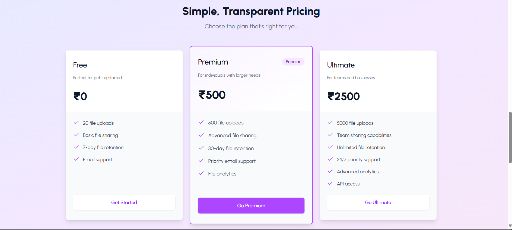

# CrossCloud – Secure File Sharing & Storage

## Overview

CrossCloud is a modern, secure file sharing and storage platform. Users can upload, manage, and share files, purchase credits, and view their transaction history. The app features a beautiful UI, robust authentication, and seamless payment integration.

---
Here is the images of UI
1. LANDING PAGE

2. DASHBOARD PAGE 

3. FEATURES PAGE 

4. PRICING PLANS 

## Tech Stack

- **Frontend:** React (Vite), Tailwind CSS, Axios
- **Backend:** Node.js, Express, Mongoose (MongoDB)
- **Authentication:** Clerk.dev
- **Payments:** Razorpay
- **Other:** JWT, REST API, Context API, Cloud deployment

---

## Features

- Secure file uploads and downloads
- User authentication (Clerk)
- Credits system for uploads
- Razorpay payment integration for purchasing credits
- Transaction history
- Responsive, modern UI
- Admin and user dashboards

---

## Terminologies & Tools

- **Credits:** Each upload costs 1 credit. Buy more credits via Razorpay.
- **Clerk:** Used for user authentication and session management.
- **Razorpay:** Payment gateway for credit purchases.
- **MongoDB:** Stores user, file, and transaction data.
- **REST API:** Communication between frontend and backend.
- **Context API:** Manages user credits state in React.

---

## Packages Used

- `react`, `react-dom`, `react-router-dom`
- `@clerk/clerk-react`
- `axios`
- `tailwindcss`
- `lucide-react` (icons)
- `express`, `mongoose`, `dotenv`, `cors`
- `razorpay`, `crypto` (backend)
- `multer` (file uploads)

---

## Getting Started

### 1. Clone the Repository

```bash
git clone https://github.com/your-username/cloud-share-app.git
cd cloud-share-app
```

### 2. Setup Environment Variables

- **Frontend (`client/.env`):**
  ```
  VITE_RAZORPAY_KEY=your_razorpay_key
  VITE_CLERK_PUBLISHABLE_KEY=your_clerk_publishable_key
  ```

- **Backend (`server/.env`):**
  ```
  MONGODB_URI=your_mongodb_uri
  RAZORPAY_KEY_ID=your_razorpay_key_id
  RAZORPAY_KEY_SECRET=your_razorpay_key_secret
  CLERK_SECRET_KEY=your_clerk_secret_key
  ```

### 3. Install Dependencies

```bash
cd client
npm install
cd ../server
npm install
```

### 4. Run Locally

- **Backend:**  
  ```bash
  npm start
  ```
- **Frontend:**  
  ```bash
  npm run dev
  ```

### 5. Visit the App

- Local: [http://localhost:5173](http://localhost:5173)
- Hosted: [https://your-deployed-url.com](https://your-deployed-url.com) (update after deployment)

---

## Deployment

- Deploy backend (Node/Express) to services like Render, Railway, or Heroku.
- Deploy frontend (Vite/React) to Vercel, Netlify, or similar.
- Set all environment variables in your deployment dashboard.
- Update CORS and API URLs for production.

---

## Screenshots

_Add your screenshots to a `/screenshots` folder and reference them above._

---

## License

MIT
